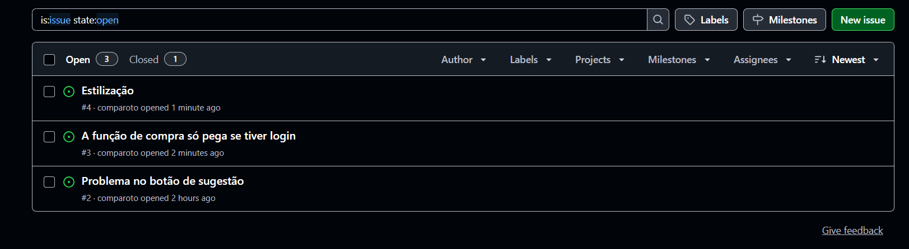

# Conecta Arena 🏟️

O projeto Conecta Arena está sendo desenvolvido com o objetivo de criar uma aplicação web voltada para a Arena Pernambuco, visando solucionar o problema de baixa ocupação efetiva e subutilização do espaço. O sistema possibilitará a conexão entre a administração do equipamento público e os cidadãos, facilitando a divulgação de eventos culturais, esportivos e corporativos.

## 📋 Índice

* [Entrega 1](#entrega-1)
* [Entrega 2](#entrega-2)
* [Entrega 3](#entrega-3)
* [Entrega 4](#entrega-4)
---

## Entrega 1

- [Histórias de Usuário - Google Docs](https://docs.google.com/document/d/14mVCGJEfeiR7oN51TRB3UKwZIKDrzhR2z3nLTI25dKo/edit?usp=sharing)
- [Protótipo Figma](https://www.figma.com/design/MF9wEsv166XqiNlBZGceJP/Conecta-Arena?node-id=3-485&t=LgbOso7bPJNhc88U-1)
- [Screencast Protótipo Figma](https://youtu.be/1O8QA4T2W_Q?si=C8w6k2fqdcu9Mezj)

##  Entrega 2

- Implementação de 2 HU✔️
- [Screencast 2 HU](https://youtu.be/ehbncqpZdrE)
- Issues atualizado ✔️

##  Entrega 3

- Implementação de 2 HU✔️
- [Screencast 2 HU](https://www.youtube.com/watch?si=iUFOywEshCSOe54E&v=_nZ3VLmfrmI&feature=youtu.be)
- Issues atualizado ✔️
  
##  Entrega 4

- Implementação de 2 HU✔️
- [Screencast semifinal](https://www.youtube.com/watch?si=iUFOywEshCSOe54E&v=_nZ3VLmfrmI&feature=youtu.be)
- Issues atualizado ✔️

### Issues/Bug Tracker

#### Relatório Evolutivo
- [Relatório](https://docs.google.com/document/d/1HQrfCskFHfdq33UlZEy46uq7AfxOLlP3F9qMNpJru8o/edit?tab=t.0)

## 👩‍💻 Equipe 
- [Iza Malafaia](https://github.com/Iza-Malafaia) 
- [Juliana Comparoto](https://github.com/comparoto) 
- [Joanna Farias](https://github.com/Joanna-Farias) 
- [Maria Luiza](https://github.com/alumiria) 
